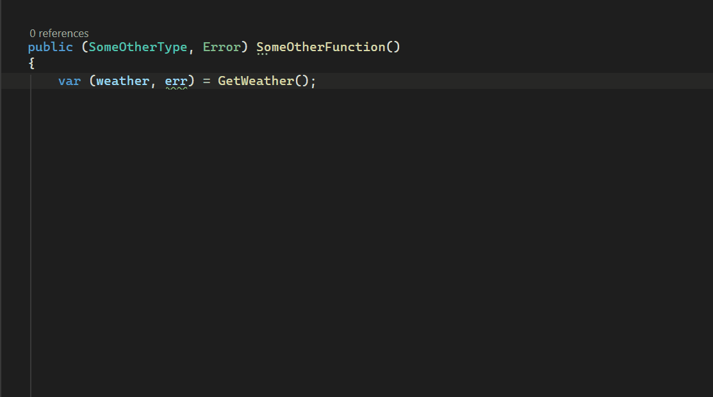
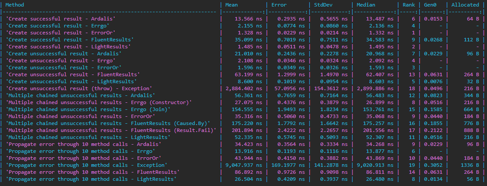

### Go-style errors-as-values in C#


## Install

```bash
dotnet add package Errgo
```

## Quick Start

The Errgo library contains only one type: `Error`

With traditional result-pattern libraries you usually use some kinda of generic Result<T> type to wrap the actual result and/or a possible error(s), something like:

```
public Result<WeatherForecast> GetWeather() { }
```

With `Errgo` you don't use wrapper classes. Your functions are supposed to *explicitly* return the return type _and_ an error, as a .NET C# tuple:

```csharp
public (WeatherForecast, Error) GetWeather() { }
```

That's it. You just return the _thing_ and an _error_.

The call-site is required to check the returned error and if the calling function uses the same tuple return pattern, it can choose to just return the same error:

```csharp
public (SomeOtherType, Error) SomeOtherFunction() 
{ 
	var (weather, err) = GetWeather();
	if (err) return (null, err); // <-- Return the same error
	else return (SomeOtherType, Error.None); // <-- built-in Error value that indicates success
}
```

...or you can wrap the error within another Error to give the error more context to the next call-site:

```csharp
public (SomeOtherType, Error) SomeOtherFunction() 
{ 
	var (weather, err) = GetWeather();

	// Wrap the error within another error
	if (err) return (null, new Error("SomeOtherFunction failed", err)); 
}
```

> NOTE: Checking the returned error can be enforced by installing the [Errgo.Analyzer](https://www.nuget.org/packages/Errgo.Analyzer/0.1.0-alpha) package. Never let errors go unhandled!



## Features

### Message:` string`
`Message` contains the given message of the error (or a default message if not specified)
```csharp
	var err = new Error("Connection timeout");
	Console.WriteLine(err.Message);
```
> Output:\
Connection timeout

### MessageDetails`: string`
`MessageDetails` contains the given message and the source location info where the Error was created.
```csharp
	var err = new Error("Connection timeout");
	Console.WriteLine(err.MessageDetails);
```
> Output:\
Connection timeout at GetWeather in WeatherService.cs:line 33

### Stack`: string`
`Stack` contains all the error messages of the current error and it's inner errors that have been cumulated during the call-chain in a single message.
```csharp
	var err = new Error("Connection timeout");
	var err2 = new Error("Connection failed", err);
	var err3 = new Error("Catastrophic failure", err2)
	Console.WriteLine(err3.Stack);
```
> Output:\
	Catastrophic failure at SomeFunction in SomeSourceFile.cs:line 19\
	Connection failed at SomeFunction in SomeSourceFile.cs:line 18\
  Connection timeout at SomeFunction in SomeSourceFile.cs:line 17

### Sentinel errors
Sentinel errors are pre-defined errors. They do not contain source location info, so wrap them in other Errors for better context.
```csharp
	public static readonly Error NotFound = Error.Sentinel("Not found");

	// Wrap in another error
	var err = new Error($"Fetching user with id {id} failed", NotFound);

	Console.WriteLine(err.Stack);
```
> Output:\
	Fetching user with id 123 failed at SomeFunction in SomeSourceFile.cs:line 19\
	Not found

### Pattern matching: Error.Is()
`Is()` checks if this error or any error in its inner errors matches the target error. Good for matching against sentinel errors.
```csharp
	public static readonly Error NotFound = Error.Sentinel("Not found");
	public static readonly Error ConnectionTimeout = Error.Sentinel("Connection timed out");

	if (err.Is(Error.None)) // ...
	else if (err.Is(ConnectionTimeout)) // ...
	else if (err.Is(NotFound)) //...
```

### Pattern matching: Error.As()
`As()` attempts to find an error in the inner error chain that matches the target error and extracts the matched error.
```csharp
	if (err.As(NotFoundError, out var matchedError)) 
	{
		Assert.Equal(NotFoundError, matchedError); // True
	}
```

### Error.Join()
`Join()` combines the given errors, returning a new Error where the specified Errors are the returned Error's inner errors.
```csharp
	var oneErrToRuleThemAll = Error.Join(err1, err2, err3, err4, ...);
```

### Error.None
`Error.None` is the canonical non-error, meant to be returned on success paths. Due to the implicit bool operator of the Error type, Error.None values resolve to `false` while every other Error resolves to true.
```csharp
	var err = Error.None;
	if (err) { ... } // The code inside the if-statement will not be reached
```

### Error.Empty
`Error.Empty` does not contain a message and no source location information.
```csharp
	var errors = Error.Empty;

	var err = ValidateEmail(...);
	if (err) errors = Error.Join(errors, err);

	(isValid, err) = ValidateAge(...);
	if (err) errors = Error.Join(errors, err);

	(isValid, err) = ValidateUsername(...);
	if (err) errors = Error.Join(errors, err);

	if (errors)
	{
		Console.WriteLine(errors.Stack);
	}
```

### Performance
`Error` is a struct and therefore somewhat lightweight, reducing heap allocations and GC pressure. Here's some benchmark numbers. 

>The benchmark code can be found in `Erggo.Benchmarks` directory. 

## Requirements

.NET Standard 2.1

## License

MIT — see the [repository](https://github.com/TDMR87/Errgo) for the full source and documentation.
